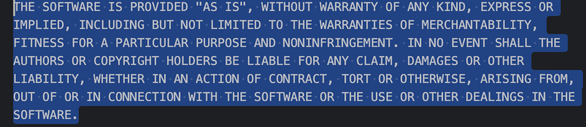
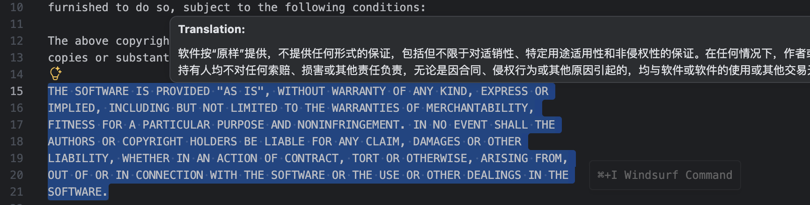

# Translator

[](https://marketplace.visualstudio.com/items?itemName=formulahendry.translator)

Translate between any language with AI-powered translation support.

## Features

- **Hover Translation**: Hover on a word to see instant translation
- **Selection Translation**: Select text to translate
- **Multiple Translation Providers**:
  - **Youdao**: Traditional dictionary-based translation ! unusable 
  - **SiliconFlow**: AI-powered translation using LLM models (default)
- **Smart Caching**: Built-in translation cache to reduce API calls
- **Language Auto-Detection**: Automatically translate between your first and second language
- **Customizable Prompts**: Customize AI translation behavior with system prompts
- **Debug Logging**: Optional logging for troubleshooting

## Installation

1. Open VS Code
2. Press `Ctrl+Shift+X` (Windows/Linux) or `Cmd+Shift+X` (macOS) to open Extensions
3. Search for "Translator"
4. Click Install

## Usage

### Basic Translation

Select text you want to translate:



Hover on text to translate:



### Keyboard Shortcuts

- `Ctrl+Alt+Z` (Windows/Linux) / `Cmd+Alt+Z` (macOS): Translate selected text

### Commands

- `Translate`: Translate selected text or word under cursor
- `Replace with Translation`: Replace selected text with translation
- `Toggle - Capture Word`: Enable/disable hover translation

## Configuration

Configure the extension in VS Code settings (`Ctrl+,`):

### Translation Provider

| Setting | Description | Default |
|---------|-------------|---------|
| `translator.provider` | Translation service provider (`youdao` or `siliconflow`) | `siliconflow` |

### SiliconFlow Settings (AI Translation)

| Setting | Description | Default |
|---------|-------------|---------|
| `translator.siliconflow.apiKey` | SiliconFlow API key | `""` |
| `translator.siliconflow.model` | AI model for translation | `THUDM/GLM-4-9B-0414` |
| `translator.siliconflow.baseUrl` | API base URL | `https://api.siliconflow.cn/v1` |
| `translator.siliconflow.systemPrompt` | Custom system prompt for AI translation | `""` (use default) |

> **Note**: The default model `THUDM/GLM-4-9B-0414` is free to use (RPM < 1000). You can get your API key from [SiliconFlow](https://cloud.siliconflow.cn/i/z7W4kiHi).

> **Tip**: These settings are compatible with any OpenAI-compatible API provider. You can replace `baseUrl` and `apiKey` with other providers like:
> - **OpenAI**: `https://api.openai.com/v1`
> - **Azure OpenAI**: Your Azure endpoint
> - **DeepSeek**: `https://api.deepseek.com/v1`
> - **Other OpenAI-compatible services**: Just update the `baseUrl` and use corresponding `apiKey` and `model`

### Language Settings

| Setting | Description | Default |
|---------|-------------|---------|
| `translator.firstLanguage` | Your native/primary language | `中文` |
| `translator.secondLanguage` | Target language for translation | `英文` |

The extension automatically detects the source language and translates to the other language.

### Cache Settings

| Setting | Description | Default |
|---------|-------------|---------|
| `translator.cacheEnabled` | Enable translation cache | `true` |
| `translator.cacheMaxSize` | Maximum cached translations | `200` |
| `translator.cacheTTL` | Cache time-to-live (minutes) | `30` |

### Debug Settings

| Setting | Description | Default |
|---------|-------------|---------|
| `translator.enableLog` | Enable debug logging in output channel | `true` |
| `translator.captureWord` | Enable hover translation | `true` |

## Getting Started with SiliconFlow

### Step 1: Register Account

1. Visit [SiliconFlow Official Website](https://cloud.siliconflow.cn/i/z7W4kiHi) ! Here use my invite code you can delete it; 
2. Click "注册" (Register) button
3. Sign up with:
   - Email address
   - Phone number (Chinese mobile number required)
   - Or use WeChat/Alipay quick login

### Step 2: Get API Key

1. After registration, login to your account
2. Navigate to **控制台** (Console) → **API 密钥** (API Keys)
   - Direct link: [https://cloud.siliconflow.cn/account/ak](https://cloud.siliconflow.cn/account/ak)
3. Click **创建新密钥** (Create New Key)
4. Enter a key name (e.g., "vscode-translator")
5. Click **确认** (Confirm)
6. **Copy the API key immediately** (it won't be shown again)
   - Format: `sk-xxxxxxxxxxxxxxxxxxxxxxxxxxxxxxxx`

### Step 3: Configure in VS Code

1. Open VS Code Settings (`Ctrl+,` or `Cmd+,`)
2. Search for "translator"
3. Find **SiliconFlow API Key** setting
4. Paste your API key

Or add directly to `settings.json`:
```json
{
  "translator.siliconflow.apiKey": "sk-xxxxxxxxxxxxxxxxxxxxxxxxxxxxxxxx"
}
```

### Step 4: Start Using

- Hover on any English word → See Chinese translation
- Select Chinese text → See English translation
- Press `Ctrl+Alt+Z` → Translate selection

### Free Tier Limits

The default model `THUDM/GLM-4-9B-0414` is **FREE** with these limits:
- **RPM (Requests Per Minute)**: < 1000 requests/minute
- **TPM (Tokens Per Minute)**: Limited by model
- No charge for normal development use

### Pricing & Quota Check

- View your usage: [Console Dashboard](https://cloud.siliconflow.cn/)
- Free quota refreshes monthly
- For higher limits, consider upgrading to paid plan

### Troubleshooting

**No translation appearing?**
1. Check API key is set correctly
2. Enable debug logging: `translator.enableLog` → `true`
3. View logs in Output channel (View → Output → select "Translator")

**API errors?**
- Verify API key format starts with `sk-`
- Check account balance/quota in console
- Ensure network connectivity (use proxy if needed)

## Change Log

See Change Log [here](CHANGELOG.md)

## Issues

If you find any bug or have any suggestion/feature request, please submit the [issues](https://github.com/LuckyMagacian/vscode-translator/issues) to the GitHub Repo.

## License

MIT License

## Acknowledgments

### Original Author

Special thanks to [formulahendry](https://github.com/formulahendry) for creating the original [vscode-translator](https://github.com/formulahendry/vscode-translator) project.

### SiliconFlow

Thanks to [SiliconFlow](https://siliconflow.cn/) for providing free AI model services that make AI-powered translation accessible to everyone.

## Attribution

This project is a fork of [vscode-translator](https://github.com/formulahendry/vscode-translator) originally created by [formulahendry](https://github.com/formulahendry).

### Original Project

- **Repository**: https://github.com/formulahendry/vscode-translator
- **License**: MIT
- **Author**: formulahendry

### Changes

This fork includes the following enhancements:
- Added SiliconFlow AI translation provider
- Implemented translation cache system
- Added customizable system prompts
- Enhanced language auto-detection
- Added debug logging functionality